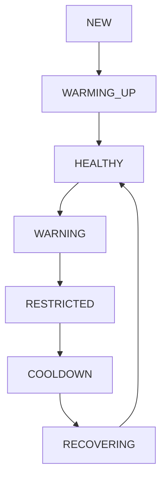

# Operations Manual

This document governs the day-to-day operation of the Instagram Reels Automation platform.

## 1. Account Lifecycle

Accounts transition through several states based on their behavior and Meta's API responses.

### Lifecycle States

| State | Entry Condition | Exit Condition | Upload Limit | Notifications |
| :--- | :--- | :--- | :--- | :--- |
| **NEW** | Added to config with `isNewAccount: true`. | First upload completes. | 1 per day | None |
| **WARMING_UP** | `enableWarmup: true`, day < 30. | Warm-up reaches target limit. | Dynamic (e.g. 1-32) | Daily summary includes progress. |
| **HEALTHY** | Score >= 80. | Score drops below 80. | Target / Config Limit | None |
| **WARNING** | Score between 60 and 79. | Score rises or drops further. | Target / Config Limit | Degraded warning sent. |
| **RESTRICTED** | Received `action_blocked` or `checkpoint_required`. | Account is moved to cooldown. | 0 (Processing blocked) | Critical alert sent. |
| **COOLDOWN** | Score < 40. | 48-168 hours elapse. | 0 | Cooldown start alert. |
| **RECOVERING** | Cooldown expires. | 5 consecutive successes (+1 health). | Clamped to 25% of Target | Cooldown end alert. |

## 2. Service Level Objectives (SLOs)

These metrics evaluate the system's performance over time. Violations should trigger operational reviews.

- **Upload Success Rate:** > 98% (Excluding external Meta outages).
- **Scheduler Uptime:** > 99.9% (Cron fires on time without overlapping).
- **Queue Latency:** < 10 minutes (Time from Enqueue -> Publish).
- **Drive Polling Latency:** < 15 seconds per account folder.
- **Health Service Availability:** > 99.9%.

## 3. Risk Register

Operators must understand the limits of this automation platform.

| Risk ID | Description | Mitigation / Note |
| :--- | :--- | :--- |
| **R-01** | Meta may issue restrictions despite conservative scheduling. | Algorithms change unpredictably. Do not rely entirely on the 32/day limit as a guarantee of safety. |
| **R-02** | Graph API endpoints, errors, or limits can change without notice. | The system parses error messages via heuristics. An unmapped error maps to a standard network failure penalty (-0). |
| **R-03** | Long-lived Graph API tokens expire after ~60 days. | They require periodic manual renewal. The scheduler warns 10 days in advance. |
| **R-04** | False-failures on Meta's side (timeout returned but video posted). | The queue relies on DB ID locks, but a false-negative from Meta requires manual verification on the Instagram app to delete the duplicate. |

## 4. Version Information Requirement

When filing incident reports or observing anomalies, operators MUST log the following environment information:

- **Git Commit:** (e.g., `git rev-parse HEAD`)
- **Git Tag:** (e.g., `v1.0.0`)
- **Prisma Schema Version:** (Matches latest migration)
- **Node Version:** (e.g., `v20.x`)
- **Deployment Date:** (When this instance started)
